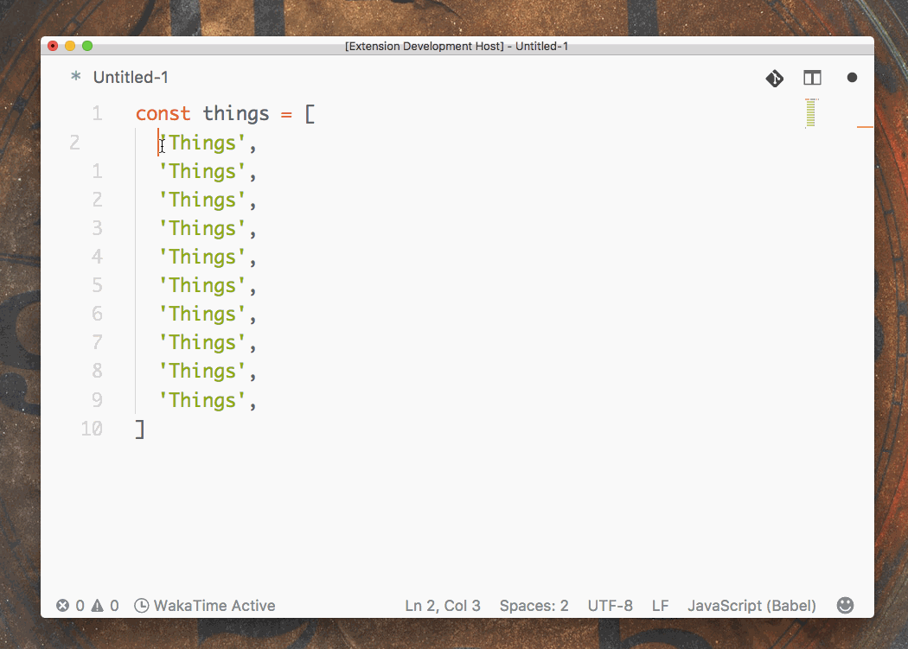

# map-replace.js for VSCode

<p align="center">
  
</p>

<p align="center">
Replace selected string with custom JavaScript function.
</p>

## Features



### Examples

```javascript
const things = [
  'Things',
  'Things',
  'Things',
  'Things',
  'Things',
  'Things',
  'Things',
]
```

Enter custom transform function:

```javascript
(value, index) => `${value} #${index}`
```

Then generates:

```javascript
const things = [
  'Things #0',
  'Things #1',
  'Things #2',
  'Things #3',
  'Things #4',
  'Things #5',
  'Things #6',
]
```

## TODOs

- [ ] custom templates

## Credits

Idea taken from [@zetavg](https://github.com/zetavg)

## License

MIT
