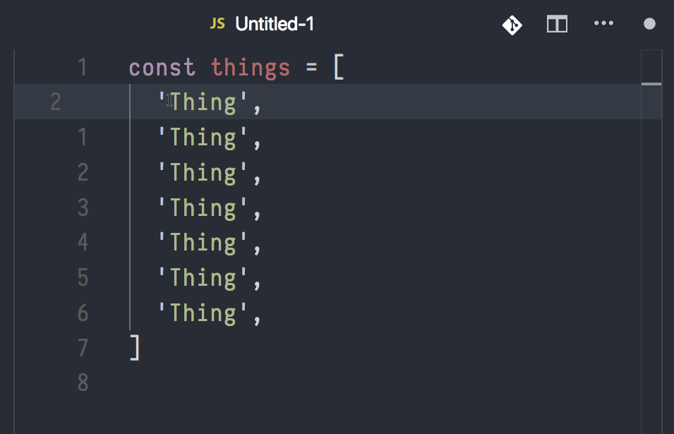

# map-replace.js for VSCode

<p align="center">
  
</p>

<p align="center">

Replace selected string with custom JavaScript function.
</p>

[][1]
[][1]
[][1]

[1]: https://marketplace.visualstudio.com/items?itemName=Yukai.map-replace-js

## Features



### Examples

```javascript
const things = [
  'Thing',
  'Thing',
  'Thing',
  'Thing',
  'Thing',
  'Thing',
  'Thing',
]
```

Make selections on all `Thing` strings, call the command and enter custom transform function:

```javascript
(value, index) => `${value} #${index}`
```

Then generates:

```javascript
const things = [
  'Thing #0',
  'Thing #1',
  'Thing #2',
  'Thing #3',
  'Thing #4',
  'Thing #5',
  'Thing #6',
]
```

## TODOs

- [x] Live Preview
- [ ] custom templates

## Credits

Idea from [@zetavg](https://github.com/zetavg)

## License

MIT
